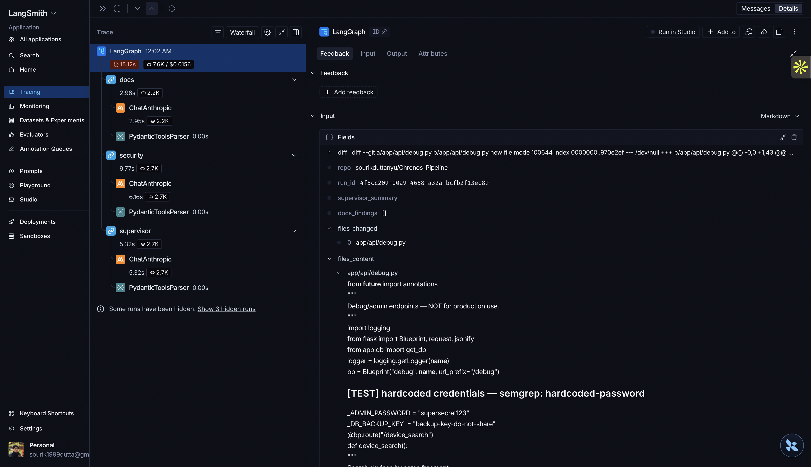

# Sentinel

> Sentinel automatically reviews pull requests for security vulnerabilities and documentation gaps, then posts a structured, ranked report as a GitHub comment — with a human approval step before anything is posted.

---

## Why This Exists

Code review is a bottleneck. Security issues slip through not because reviewers do not care, but because they are reviewing logic rather than running static analysis and reading every docstring in context. Sentinel does the mechanical part — running Semgrep, querying an LLM, aggregating findings — so human reviewers can focus on what matters.

---

## How It Works

When a PR is opened or updated:

1. GitHub App fires a webhook to Sentinel's FastAPI server
2. PR diff and changed file contents are fetched via JWT-authenticated GitHub API
3. **SecurityAgent** and **DocsAgent** run in parallel:
   - SecurityAgent runs Semgrep on changed files, sends findings + diff to Claude — structured severity-ranked issues
   - DocsAgent sends diff to Claude — flags missing or stale docstrings on changed functions
4. **SupervisorAgent** aggregates both agents, deduplicates, resolves conflicts, produces ranked markdown review
5. Graph pauses — human approves via `POST /approve/{run_id}`
6. Sentinel posts the final review as a GitHub PR comment

Every node is traced end-to-end in LangSmith. Graph state is checkpointed to SQLite and survives server restarts.

---

## Architecture

```
GitHub Webhook
       ↓
 FastAPI /webhook
       ↓
 LangGraph (SqliteSaver checkpoint)
       ↓
 ┌─────────────────┬─────────────────┐
 │  SecurityAgent  │    DocsAgent    │  ← parallel
 │ Semgrep + Claude│     Claude      │
 └────────┬────────┴────────┬────────┘
          └────────┬─────────┘
                   ↓
          SupervisorAgent
                   ↓
          [INTERRUPT — human approval]
                   ↓
          POST /approve/{run_id}
                   ↓
          GitHub PR Comment
```

---

## LangSmith Trace



*Parallel docs + security nodes, per-node latency breakdown, token counts, full state visible at each step*

---

## Measured on Real PRs

| Metric | Value |
|---|---|
| Latency — clean PR (no findings) | 4.68s |
| Latency — PR with 6 findings, 3 LLM calls | 15.13s |
| Semgrep raw findings | 6 |
| Claude findings after filtering | 4–5 |
| Contextual issues Claude caught vs Semgrep | 1 (debug endpoint exposure) |
| LLM calls per review | 3 (Security + Docs + Supervisor) |
| Cost per review — with findings | ~$0.016 |
| Cost per review — clean PR | ~$0.003 |
| Tokens per full review | ~7,500–7,800 |

---

## Stack

| Layer | Technology |
|---|---|
| Orchestration | LangGraph 1.1.10 |
| LLM | Claude Haiku (claude-haiku-4-5-20251001) |
| Static Analysis | Semgrep (auto ruleset) |
| Webhook Server | FastAPI + uvicorn |
| GitHub Integration | GitHub App — JWT → installation token |
| Observability | LangSmith |
| State Persistence | SqliteSaver (SQLite) |
| Language | Python 3.13 |

---

## Setup

> Full step-by-step instructions including GitHub App creation: **[SETUP.md](./SETUP.md)**

```bash
git clone https://github.com/sourikduttanyu/Sentinel
cd Sentinel
python -m venv .venv && source .venv/bin/activate
pip install -r requirements.txt
cp .env.example .env  # fill in credentials
python main.py
```

Required environment variables:

```
GITHUB_APP_ID=
GITHUB_APP_PRIVATE_KEY_PATH=./keys/sentinel.pem
GITHUB_WEBHOOK_SECRET=
GITHUB_INSTALLATION_ID=

ANTHROPIC_API_KEY=
LANGCHAIN_TRACING_V2=true
LANGCHAIN_API_KEY=
LANGCHAIN_PROJECT=sentinel
```

## Approving a Review

After Sentinel processes a PR the graph pauses. Approve to post:

```bash
curl -X POST http://localhost:8000/approve/{run_id}
```

`run_id` is printed in server logs and returned in the webhook response.

---

## Project Structure

```
sentinel/
├── api/webhook.py          # Webhook receiver + /approve endpoint
├── agents/
│   ├── security_agent.py   # Semgrep + Claude → structured security findings
│   ├── docs_agent.py       # Claude → docstring gap detection
│   └── supervisor_agent.py # Aggregation, dedup, conflict resolution, markdown
├── graph/workflow.py       # LangGraph graph + SqliteSaver checkpointer
├── tools/
│   ├── semgrep_tool.py     # Semgrep subprocess wrapper
│   └── github_tool.py      # GitHub App JWT auth + API calls
├── models/state.py         # PRReviewState TypedDict
├── config.py
└── main.py
```

---

## Technical Highlights

**Parallel agent execution** — SecurityAgent and DocsAgent are both edges from `START` in the LangGraph StateGraph. LangGraph runs them in a thread pool simultaneously. They write to separate state keys so there is no collision. Supervisor reads both after they complete.

**Human-in-the-loop** — Graph compiled with `interrupt_before=["post_comment"]`. State is checkpointed to SQLite after every node. Calling `/approve/{run_id}` resumes the exact graph run from where it paused — survives server restarts.

**False positive reduction** — Semgrep provides pattern-matched findings. Claude reviews them in context of the full diff, filters noise, and adds contextual findings Semgrep cannot detect (e.g. debug endpoints with RCE vulnerabilities marked "not for production" but still registered as live routes).

---

## Production Architecture

For how Sentinel would evolve at scale — SQS-backed worker pool, Redis checkpointing, retrieval-augmented review, eval harness, multi-tenancy, and cost optimization — see **[FUTURE.md](./FUTURE.md)**.
